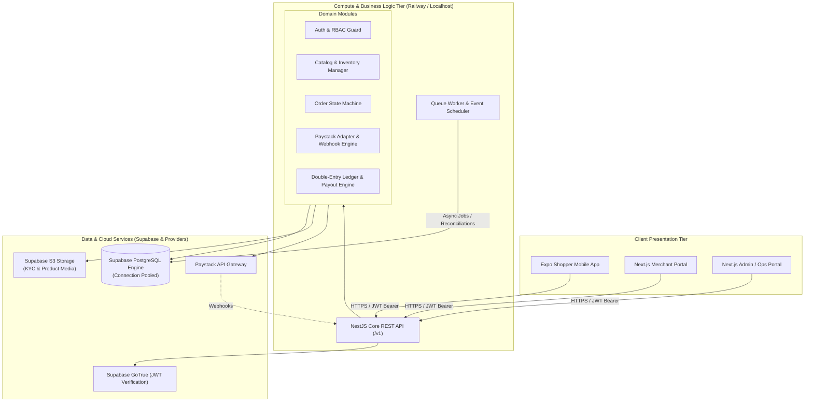

# Backend, Database & Infrastructure Strategy

**Project:** SellFastBuyFast (BuyFastSellFast)  
**Version:** 1.0.0 (Production Blueprint)  
**Status:** Approved Architectural Decision Record (ADR)  
**Scope:** Database selection, backend execution topology, cost modeling, Ethnikraft code adaptation, and security boundaries.

---

## 1. Executive Summary & Technology Matrix

SellFastBuyFast is a curated multi-vendor marketplace operating with strict transactional, inventory, and double-entry financial ledger requirements. 

This document defines the definitive backend and data strategy: **Supabase (PostgreSQL, Auth, Storage)** as the data and identity foundation, paired with a **Modular Core API & Queue Worker (hosted locally in dev, on Railway in deployment)** for business execution, financial state machines, and Paystack payment processing.

### Technology Selection Matrix

| Layer | Selected Technology | Role & Justification | Alternatives Evaluated & Rejected |
| :--- | :--- | :--- | :--- |
| **Database Engine** | **PostgreSQL** | ACID transactions, strict relational foreign keys, double-entry ledger balancing, row-level locks (`SELECT FOR UPDATE`), JSONB metadata indexing. | **MongoDB/Firestore:** Rejected due to lack of multi-table ACID guarantees and ledger integrity risks.<br>**MySQL:** Rejected due to weaker JSONB and advanced indexing ecosystem. |
| **Data & Auth Platform** | **Supabase** | Managed PostgreSQL with Supavisor connection pooling, GoTrue Auth engine (JWT/OTP), and S3-compatible asset storage under a single unified dashboard. | **Neon:** Rejected because it only provides DB, requiring extra paid third-party services for Auth (Clerk/Auth0) and Storage (AWS S3).<br>**AWS RDS:** Rejected due to high minimum monthly baseline cost and heavy DevOps overhead. |
| **Backend Compute** | **Modular Node / NestJS Core API** | Enforces all domain rules, stock reservations, order state transitions, Paystack webhook processing, and ledger journal generation. | **Pure Serverless Functions (Vercel Lambdas):** Sub-optimal for long-running queue workers, webhooks, and durable transaction lifecycles. |
| **Backend Hosting** | **Localhost (Dev) / Railway (Live)** | Containerized hosting with zero-friction Git continuous deployment, environment variable management, private networking, and health checks. | **AWS ECS/Kubernetes:** Over-engineered for early-stage and MVP velocity.<br>**Heroku:** Higher pricing and outdated tooling. |
| **Payment Gateway** | **Paystack** | Primary Nigeria-first transactional gateway for card, bank transfer, and USSD checkouts. | N/A (Standard for target operational market). |

---

## 2. Cost Analysis & Budget Architecture

The entire architecture is designed to operate at **$0.00 / month** throughout the development, testing, and MVP onboarding phase, with predictable scaling triggers.

### Free Tier vs. Scale Tier Breakdown

```
+-----------------------------------------------------------------------------------+
| Component      | Development & MVP Phase ($0/mo)    | Scaled Production Tier      |
+-----------------------------------------------------------------------------------+
| Supabase       | • Free Tier: 500 MB Postgres       | • Pro Tier: $25 / month     |
|                | • 50,000 Monthly Active Users      | • Automatic daily backups   |
|                | • 1 GB S3 File Storage             | • Point-in-time recovery    |
|                | • 5 GB Egress Bandwidth            | • 8 GB DB / 100 GB Storage  |
+----------------+------------------------------------+-----------------------------+
| Backend / API  | • Localhost Mac runtime ($0)       | • Railway Usage-based       |
| & Worker       | • Railway Starter Credits ($5 free)| • ~$5 to $15 / month        |
+----------------+------------------------------------+-----------------------------+
| Client Apps    | • Local Expo Go / Emulators        | • Expo EAS Free Tier        |
| (Mobile & Web) | • Vercel Free Hobby Tier (Portals) | • Custom domain on Vercel   |
+----------------+------------------------------------+-----------------------------+
| Payment API    | • Paystack Sandbox / Test Mode ($0)| • Standard transaction %    |
+----------------+------------------------------------+-----------------------------+
| Total Baseline | $0.00 / month                      | ~$30.00 / month             |
+-----------------------------------------------------------------------------------+
```

> [!NOTE]
> Transition to paid tiers is only required when active customer volume and sales revenue are already being generated.

---

## 3. System Architecture & Trust Boundaries

The system strictly decouples **Client Presentation**, **Backend Domain Logic**, and **Data Storage**.



### Architectural Guardrails

1. **The Non-Negotiable Database Isolation Rule:**
   - Client applications **never** write directly to financial, order, inventory, or ledger tables via Supabase client SDKs.
   - All state mutations are commanded via authenticated HTTP requests to the Core API (`/v1/...`).
   - The Core API holds the database service-role credentials in its private environment and executes multi-table transactional mutations using explicit `BEGIN...COMMIT` blocks.

2. **Money and Stock Representation:**
   - **Zero Floating Point Math:** All monetary amounts are represented as `bigint` minor units (e.g., Kobo for NGN: `10000` = ₦100.00).
   - **Inventory Reservation:** Checking out places a time-bounded lock/reservation on stock lines to prevent overselling. Unpaid checkouts automatically release stock via background worker expiration.

3. **Double-Entry Bookkeeping:**
   - Every financial state change (Order Payment, Platform Commission, Merchant Pending Balance, Dispute Hold, Payout Settlement) creates balanced `journal_entries` and `journal_lines` that must balance to zero.

---

## 4. Ethnikraft Codebase Adaptation Strategy

SellFastBuyFast will strategically adapt proven user interface and management modules from the existing **Ethnikraft** repository while excising unused or conflicting features.

```
                  ETHNIKRAFT REPOSITORY
                            │
       ┌────────────────────┴────────────────────┐
       ▼                                         ▼
[ KEEP & ADAPT ]                          [ REMOVE / PURGE ]
• Merchant Product Catalog Forms          • Studio Editor & 3D Tools
• KYC Verification Document Dropzone      • Studio State Stores & Canvas
• Merchant Orders / Fulfillment Tables    • Studio DB Schemas & Endpoints
• Admin KYC Review & Approval Workflows   • Direct Client Supabase Mutations
• Tailored UI Components & Data Grids     • Legacy Unbalanced Payment Logic
```

### Adaptation Checklist

| Module | Source Location (Ethnikraft) | Destination in This Project | Required Refactoring |
| :--- | :--- | :--- | :--- |
| **Merchant Portal** | Vendor dashboard, product inventory, order list | `vendor-portal/` or `apps/merchant-web` | • Strip all Studio navigation & dependencies.<br>• Bind forms to new Core API `/v1/merchant/...` contracts.<br>• Ensure image uploads go to Supabase Storage signed URLs. |
| **Admin / Ops Portal** | Admin review, merchant approval, disputes | `admin-portal/` or `apps/operations-web` | • Implement strict RBAC guards (`operations_admin`, `finance_reviewer`).<br>• Wire KYC approval buttons to transactional audit endpoints. |
| **UI Components** | Data tables, badges, modals, toast hooks | `packages/ui` / Portal components | • Standardize on Tailwind + Shadcn UI primitives.<br>• Ensure responsive layout on desktop and tablet. |

---

## 5. Implementation & Execution Roadmap

### Step 1: Supabase Database Schema Initialization
- Create a new free-tier Supabase project (`sellfastbuyfast-dev`).
- Write declarative Drizzle/Prisma schema migrations implementing the tables defined in `docs/architecture/data-model-and-authorization.md`:
  - `profiles`, `merchants`, `merchant_members`, `merchant_verifications`
  - `products`, `product_variants`, `inventory_levels`, `inventory_reservations`
  - `orders`, `order_lines`, `payment_attempts`, `provider_events`
  - `ledger_accounts`, `journal_entries`, `journal_lines`, `payouts`
- Apply migrations and verify foreign keys and indexes.

### Step 2: Core API Backend Scaffolding
- Initialize the TypeScript modular backend (`services/core-api`).
- Configure Supabase Auth JWT validation middleware.
- Implement domain modules:
  - `AuthModule`: User onboarding, role assignment.
  - `CatalogModule`: Public catalog read queries + vendor product CRUD.
  - `OrderModule`: Cart checkout, stock reservation, order state transitions.
  - `PaymentModule`: Paystack initialize transaction + webhook receiver with HMAC signature verification.
  - `LedgerModule`: Double-entry accounting poster for transactions.

### Step 3: Ethnikraft UI Extraction & Integration
- Copy over needed admin and vendor screen components into `admin-portal` and `vendor-portal`.
- Remove all traces of the Studio feature.
- Connect portal data tables and forms to the Core API endpoints.

### Step 4: Paystack End-to-End Sandbox Testing
- Execute complete shopper flow: Add to Cart $\rightarrow$ Stock Reserved $\rightarrow$ Paystack Popup $\rightarrow$ Webhook Received $\rightarrow$ Stock Committed $\rightarrow$ Ledger Journal Created $\rightarrow$ Merchant Balance Credited.

### Step 5: Railway Deployment
- Create a Railway project.
- Connect Git repository and configure Core API Docker deployment.
- Inject Supabase database connection string (`DATABASE_URL`), Paystack secret keys, and JWT secrets into Railway environment variables.
- Connect web portal frontends to the live Railway API URL.
