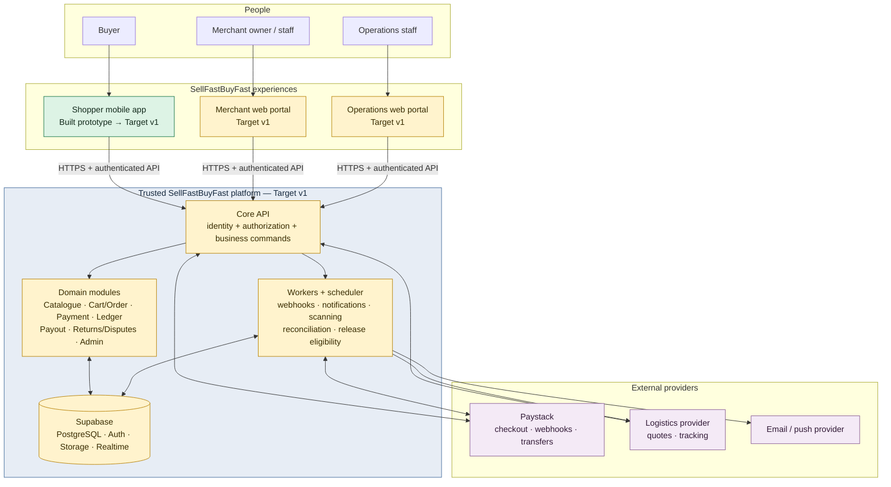
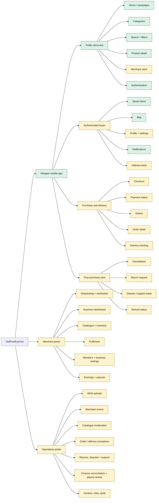

# SellFastBuyFast v1 Information Architecture

**Audience:** Founders, product, design, engineering, operations, finance, and launch partners  
**Purpose:** Define every product surface, its principal areas, ownership boundaries, and the routes between them.  
**Status key:** `Prototype` = present as non-production local-state UI; `Target v1` = draft architecture/scope, not yet implemented as a transactional platform.

## 1. Executive view

SellFastBuyFast is a proposed curated Nigerian commerce marketplace with three role-specific product surfaces:

1. **Shopper mobile app** — buyers discover, buy from one merchant per order, track delivery, and request support/returns.
2. **Merchant portal** — verified merchants manage their business, catalogue, inventory, fulfilment, and payout requests.
3. **Operations portal** — authorised staff approve merchants and products, handle exceptions, and reconcile money.

These surfaces do not own money, order-state, permissions, or provider integrations. Every privileged command goes through the Core API, which records an audit trail and delegates slow or external work to durable workers.



## 2. IA principles and non-negotiable boundaries

| Principle | IA consequence |
| --- | --- |
| Curated marketplace | Products and merchants enter the buyer catalogue only after operational approval. |
| One merchant per cart | A shopper cart, checkout, and resulting v1 order have one merchant. Adding a product from another merchant requires an explicit cart-resolution experience. |
| Server-controlled commerce | Clients display state and submit intents; they do not create paid orders, write financial state, release funds, or change roles. |
| Buyer protection | Delivery evidence, return window, returns, disputes, and refunds are first-class routes—not support afterthoughts. |
| Financial traceability | Finance views are driven from immutable ledger and reconciliation data; dashboard totals are derived, never authoritative. |
| Least privilege | Merchant and operations navigation is permission-aware. Finance, security, and approval actions are segregated. |
| Progressive disclosure | Browsing is public; authentication is required only when an action needs identity, such as saving, purchasing, tracking, or managing a business. |

## 3. Product IA by audience



## 4. Shopper mobile app — target route hierarchy

The current shopper prototype represents much of this tree through custom local-state navigation, including discovery, account, checkout simulation, orders, tracking, returns, refunds, and support. The routes below remain the draft target contract because the prototype has no production backend, provider integration, durable financial state, or complete server-side authorization.

```text
Shopper app
├── App launch
│   ├── Splash / session restore
│   ├── Onboarding (first launch)
│   └── Home
├── Discover (public)
│   ├── Home feed
│   │   ├── Campaign / hero destination
│   │   ├── Category landing
│   │   ├── Product detail
│   │   └── Merchant store
│   ├── Category browsing
│   │   └── Product listing → Product detail
│   ├── Search
│   │   ├── Search results
│   │   ├── Filters / sort
│   │   └── Product detail
│   └── Merchant store
│       └── Product detail
├── Product detail
│   ├── Media, description, price, variant, stock, merchant
│   ├── Save item → authentication if required
│   ├── Add to bag → cross-merchant guard if required
│   └── Merchant store
├── Bag (authenticated before checkout)
│   ├── Bag items / quantities / removal
│   ├── Merchant conflict resolution
│   └── Checkout
│       ├── Delivery address
│       ├── Delivery option / quote
│       ├── Order review
│       ├── Paystack hosted checkout
│       ├── Payment processing / result
│       └── Order confirmation
├── Orders (authenticated)
│   ├── Order history
│   └── Order detail
│       ├── Delivery tracking
│       ├── Cancel request (only before merchant acceptance)
│       ├── Return request (policy eligible)
│       ├── Support / dispute
│       └── Refund status
├── Saved items (authenticated)
│   └── Product detail
├── Notifications (authenticated)
│   └── Deep link to order, return, product, or support ticket
├── Account (authenticated)
│   ├── Profile
│   ├── Address book
│   ├── Communication preferences
│   ├── Privacy / account deletion request
│   ├── Help centre / support tickets
│   └── Sign out
└── Authentication
    ├── Sign up / sign in
    ├── Email or phone verification
    ├── Password recovery
    └── Return to protected intent
```

## 5. Merchant portal — target route hierarchy

```text
Merchant portal
├── Authentication + MFA for owners and members with bank, payout, or sensitive-data access
├── Onboarding
│   ├── Business profile
│   ├── KYC / business documents
│   ├── Bank account verification
│   ├── Terms acceptance
│   └── Review status: draft | submitted | approved | rejected | suspended
├── Dashboard
│   ├── Tasks requiring action
│   ├── Order and stock signals
│   └── Ledger-derived sales / settlement summary
├── Catalogue
│   ├── Products list
│   ├── Create / edit product
│   ├── Variant, media, price, stock
│   ├── Moderation status and feedback
│   └── Inventory adjustments
├── Orders / fulfilment
│   ├── Order list
│   ├── Order detail
│   ├── Accept order
│   ├── Pack / hand-off / shipment evidence
│   └── Return response and inspection evidence
├── Earnings and payouts
│   ├── Balance and transaction history
│   ├── Payout eligibility
│   ├── Payout request
│   ├── Payout history / status
│   └── Bank accounts
├── Team and business settings
│   ├── Merchant members / permissions
│   ├── Business information
│   ├── Policies / terms
│   └── Notifications
└── Help / support
```

## 6. Operations portal — target route hierarchy

```text
Operations portal
├── Authentication + staff MFA
├── Role-aware workspace
│   ├── Work queue
│   ├── Merchant verification review
│   ├── Catalogue moderation
│   ├── Order and delivery exception handling
│   ├── Returns, disputes and support tickets
│   ├── Payout review (finance reviewer)
│   ├── Reconciliation exceptions (finance reviewer)
│   ├── CMS / campaigns
│   ├── Role and access administration (security admin)
│   └── Immutable audit search
└── Case detail pattern
    ├── Evidence and policy snapshot
    ├── Timeline / state transitions
    ├── Permitted role-specific actions
    ├── Reason code / approval record
    └── Audit record
```

## 7. Ownership map: which surface owns which job

| Domain | Shopper | Merchant | Operations | Core API / worker |
| --- | --- | --- | --- | --- |
| Identity | Creates/manages own account | Manages own staff membership within permission | Assigns platform roles under controls | Enforces roles, JWT/session, audit |
| Catalogue | Browses approved content | Creates/edits own catalogue | Approves, rejects, moderates | Validates, scans, publishes read model |
| Cart/checkout | Builds cart; chooses address/delivery; starts payment | No direct access | Resolves exception only | Reserves stock, creates order/payment attempt, verifies provider outcome |
| Fulfilment | Sees status/tracking | Accepts, packs, ships | Resolves delays/incorrect delivery | Records valid transitions and ingests carrier events |
| Returns/refunds | Requests with evidence; views outcome | Responds, supplies evidence | Decides eligible exceptions | Validates policy/state; initiates confirmed refund flow |
| Finance/payouts | Sees only own payment/refund status | Views ledger-derived balance; requests payout | Reviews/reconciles/approves per separation of duties | Posts ledger, holds funds, initiates transfer, reconciles provider |

## 8. State-driven IA gates

These gates prevent screens from exposing actions that the user is not eligible to take.

| Entity | State | User-facing availability |
| --- | --- | --- |
| Merchant | `draft` / `submitted` | Onboarding only; catalogue publishing and payouts unavailable. |
| Merchant | `approved` | Catalogue, fulfilment, earnings, and eligible payout routes available. |
| Merchant | `rejected` / `suspended` | Show status and resolution path; suppress merchant trading actions. |
| Payment attempt | `created` / `initiated` / `pending` | Show payment-processing or retry guidance; do not confirm order as paid. |
| Payment attempt | `succeeded` | Unlock order confirmation and merchant fulfilment workflow only after verified provider event/verification. |
| Order | before `merchant_accepted` | Buyer cancellation may be available. |
| Order | `shipped` / `delivered` | Tracking route available. |
| Order | `return_window` | Return-request route available under approved policy. |
| Seller balance | `pending` | Display but do not allow payout request. |
| Seller balance | `available` | Permit eligible payout request. |
| Payout | `requested` through `provider_pending` | Show status; merchant cannot treat it as received. |

## 9. Implementation truth and recommended next documentation use

| Area | Current repository evidence | Founder interpretation |
| --- | --- | --- |
| Shopper UI | Expo/React Native app with mock data and local-state flows for discovery, account, checkout simulation, orders, tracking, returns, refunds, and support. | A broad visual prototype suitable for UX iteration; it is not transactional commerce. |
| Navigation | Custom route-state navigation and client-side guards rather than the target persistent route architecture. | This IA defines the server-enforced target contract; prototype guards are not an authorization boundary. |
| Merchant and operations UI | Static HTML/CSS/JavaScript portal prototypes are present. | They demonstrate workflows only; they are not the target authenticated Next.js applications. |
| Backend/platform | No implemented Core API, worker, production database, ledger, or durable provider integration is present. | The docs describe the desired v1 architecture, not deployed capability. |
| Payments/finance | Paystack is named in copy only; no provider integration or ledger exists. | Do not launch checkout, settlement, or payout until the target controls are implemented and tested. |

Use [Screen routing specification](../product/screen-routing.md) with this diagram to turn each IA node into a product/design/engineering backlog item.
