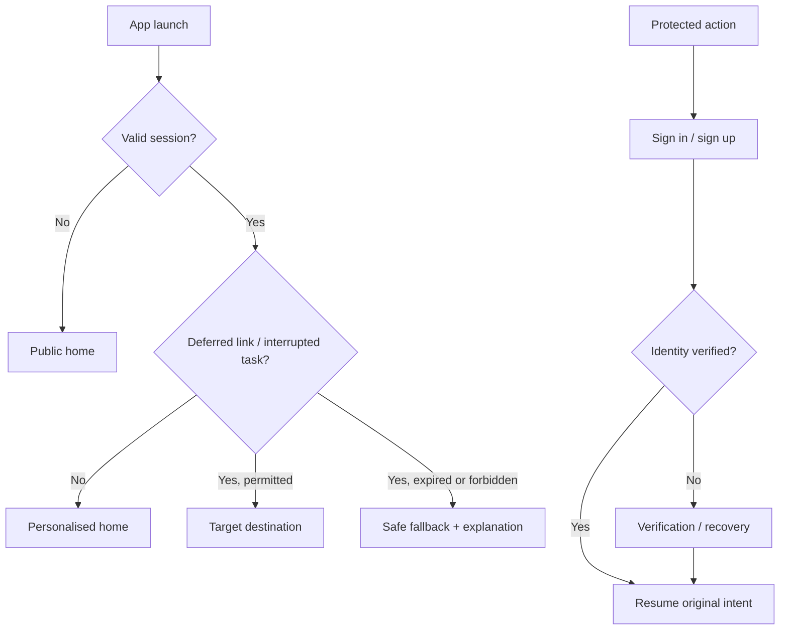
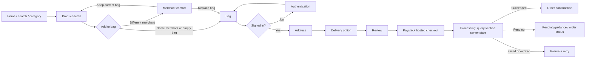
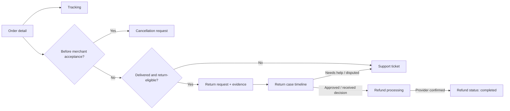

# SellFastBuyFast v1 Screen Routing Specification

**Audience:** Founders, product, UX/UI, engineering, QA, and operations  
**Companion:** [Information architecture](../architecture/information-architecture.md)  
**Scope:** Draft target v1 route contract. Current implementation includes local-state shopper flows and static merchant/operations portal prototypes, not a production transactional platform.

## 1. Route conventions

- Route names are product contracts, not an imposed framework choice. Mobile can implement them in Expo Router; web can implement equivalent Next.js routes.
- `Public` routes require no session. `Protected` routes redirect to authentication and then resume the original intent.
- An **eligibility guard** evaluates entity state and permission server-side before rendering an action or accepting its command.
- Order, payment, return, payout, and case IDs are opaque IDs; no route exposes sensitive data through predictable identifiers.
- Every command route submits an idempotency key. A success screen reflects verified server state, not only a client callback.

## 2. Global entry and recovery routing

**Fallback rules:** An expired product link opens the closest valid category or merchant store; an inaccessible order/support link opens Orders or Help; a removed product shows an unavailable state with alternatives; a payment-return link always queries the verified payment/order state before showing a result.

## 3. Shopper mobile route inventory

### 3.1 Discovery and account

| Route | Access | Primary entries | Primary exits / actions | Guard and notes |
| --- | --- | --- | --- | --- |
| `/` Home | Public | Launch, logo, bottom navigation | campaign, category, search, product, merchant | Personalise only with permitted profile data. |
| `/onboarding` | Public, first launch | Launch | home, auth | Must be dismissible and not block browsing. |
| `/search` | Public | Home search, deep link | results, filters, product | Preserve query when returning from a product. |
| `/search/filters` | Public | Search results | apply/cancel to results | Filter state is reversible and share-safe. |
| `/category/:categorySlug` | Public | Home, campaign, category nav | product, merchant, search | Only approved active catalogue is visible. |
| `/product/:productId` | Public | Listing, search, saved, campaign, deep link | merchant, save, add bag | Price/availability are fetched live; unavailable items cannot be added. |
| `/store/:merchantId` | Public | Product detail, search, campaign | product | Show only approved merchant and public catalogue state. |
| `/auth/sign-in` | Public | Protected-intent redirect, account | password recovery, sign-up, return intent | Preserve intended destination safely. |
| `/auth/sign-up` | Public | Sign-in | verification, return intent | Account creation requires consent capture. |
| `/auth/verify` | Public | Sign-up/sign-in flow | resume intent | Email/phone route depends on chosen auth policy. |
| `/auth/recover` | Public | Sign-in | reset confirmation, sign-in | Never reveal whether an account exists. |
| `/account` | Protected | Bottom navigation / profile control | addresses, notifications, support, privacy, sign-out | Buyer owns only own account data. |
| `/account/addresses` | Protected | Account, checkout | add/edit address, checkout return | Address selection is snapshot at order creation. |
| `/account/notifications` | Protected | Header/account | target deep link | Each message validates access again at destination. |
| `/account/privacy` | Protected | Account | deletion request, account | Account deletion is a request workflow, not immediate evidence deletion. |
| `/saved` | Protected | Bottom navigation, product save | product | Prompt authentication before first save. |

### 3.2 Bag, checkout, and payment

| Route | Access | Primary entries | Primary exits / actions | Guard and notes |
| --- | --- | --- | --- | --- |
| `/bag` | Public to view; protected to continue | Bottom navigation, add-to-bag | product, merchant-conflict, checkout auth | Bag must contain one merchant in v1. Persist only according to consent/session policy. |
| `/bag/merchant-conflict` | Public | Add product from a different merchant | replace bag, keep existing bag, product | Never silently discard cart contents. |
| `/checkout/address` | Protected | Bag | address book, delivery option | Re-check stock and merchant eligibility before checkout begins. |
| `/checkout/delivery` | Protected | Address step | address, review | Quote is time-bound; show failure and retry state. |
| `/checkout/review` | Protected | Delivery step | payment redirect, prior steps | API creates/resumes a draft order and payment attempt; recalculate final totals. |
| `/checkout/paystack` | Protected | Review | provider-hosted checkout, processing | Webview/browser handoff; no secret keys in client. |
| `/checkout/processing` | Protected | Provider return, resumed app | confirmation, failed, pending support | Query backend payment state; client callback is not proof. |
| `/checkout/confirmation/:orderId` | Protected | Verified success | order detail, continue shopping | Available only for a paid order. |
| `/checkout/failed` | Protected | Verified failure/expiry | retry review, bag, support | Preserve bag while revalidating stock/quote. |

### 3.3 Orders, tracking, and post-purchase care

| Route | Access | Primary entries | Primary exits / actions | Guard and notes |
| --- | --- | --- | --- | --- |
| `/orders` | Protected | Account, confirmation, notification | order detail | Buyer may see only own orders. |
| `/orders/:orderId` | Protected | Orders, confirmation, notification | tracking, cancel, return, support | Server determines available actions from current order state and policy snapshot. |
| `/orders/:orderId/tracking` | Protected | Order detail, notification | order detail, support | Use provider events when available; give manual-support fallback. |
| `/orders/:orderId/cancel` | Protected | Order detail | confirmation, order detail | Available only before merchant fulfilment acceptance under v1 policy. |
| `/orders/:orderId/return` | Protected | Order detail | evidence, request submitted | Available only in eligible return window/policy condition. |
| `/returns/:returnId` | Protected | Return submit, notification, order detail | evidence, order detail, support | Timeline shows merchant response, shipment, receipt, decision, and refund status. |
| `/orders/:orderId/support` | Protected | Order detail, tracking | ticket, order detail | Contextual ticket includes order reference but follows case access rules. |
| `/support/tickets/:ticketId` | Protected | Support centre, return/order route, notification | ticket messages, linked order/return | Only case participants and authorised staff can access. |
| `/refunds/:refundId` | Protected | Return, order detail, notification | order detail, support | Final state depends on provider confirmation/reconciliation. |

## 4. Buyer journey routing diagrams

### 4.1 Discovery to verified order

### 4.2 Order to return/refund

## 5. Merchant web route inventory

| Route | Access | Purpose / primary actions | Guard |
| --- | --- | --- | --- |
| `/merchant/auth/*` | Public | Merchant sign-in, recovery, required MFA | MFA is mandatory for owners and members with bank, payout, or sensitive-data access; server verifies the required assurance level. |
| `/merchant/onboarding/*` | Merchant member | Business profile, KYC documents, bank verification, terms, status | Merchant onboarding state. |
| `/merchant` | Approved merchant member | Action dashboard, operational signals, ledger-derived summary | Permission-aware widgets. |
| `/merchant/catalogue` | Catalogue permission | Products and moderation state | Merchant membership + catalogue permission. |
| `/merchant/catalogue/products/new` | Catalogue permission | Create product/variants/media | Upload scan and moderation requirements. |
| `/merchant/catalogue/products/:productId` | Catalogue permission | Edit own product, stock, media | Ownership and moderation constraints. |
| `/merchant/orders` | Fulfilment permission | Order queue | Merchant ownership only. |
| `/merchant/orders/:orderId` | Fulfilment permission | Accept, pack, ship, evidence, return response | Valid order state transition only. |
| `/merchant/earnings` | Finance-view permission | Ledger-derived balance and transaction history | Read-only financial facts. |
| `/merchant/payouts/new` | Payout-request permission | Request payout | Available balance, bank verification, risk/eligibility. |
| `/merchant/payouts/:payoutId` | Finance-view permission | Payout status/history | Ownership only; no status mutation. |
| `/merchant/settings/team` | Merchant-owner / delegated permission | Members and scoped permissions | Cannot grant platform roles. |
| `/merchant/settings/business` | Appropriate permission | Business and bank details | Re-authentication, beneficiary verification, cooldown, out-of-band notice, and audit controls. |

## 6. Operations web route inventory

| Route | Required role / permission | Purpose / primary actions | Mandatory control |
| --- | --- | --- | --- |
| `/ops` | Staff | Role-aware work queue | MFA, explicit role context. |
| `/ops/merchants/:merchantId/review` | Merchant reviewer | Approve/reject/suspend with evidence | Reason code + immutable audit record. |
| `/ops/catalogue/:productId/review` | Catalogue moderator | Approve/reject/request changes | Moderation history retained. |
| `/ops/orders/:orderId` | Support/operations permission | Resolve delivery/order exceptions | State and evidence constraints. |
| `/ops/returns/:returnId` | Support/dispute permission | Review return case | Policy snapshot, case timeline, auditable decision. |
| `/ops/disputes/:disputeId` | Dispute permission | Manage escalation/resolution | Separation from silent financial change. |
| `/ops/support/:ticketId` | Support agent | Work support case | Scope-limited customer data. |
| `/ops/payouts/:payoutId/review` | Finance reviewer | Risk review and approval/rejection | Separation of duties; phishing-resistant MFA. |
| `/ops/reconciliation` | Finance reviewer | Review provider mismatches, delays, duplicates | Cannot bypass unresolved controls silently. |
| `/ops/content` | Content permission | Campaign/category content | Publishing audit. |
| `/ops/access` | Security admin | Manage platform staff roles/access | Time-bounded privileged access + audit. |
| `/ops/audit` | Security/admin permission | Search immutable audit events | Read-only, sensitive access logged. |

## 7. Cross-surface handoffs

| Trigger | Source | Destination | Contract |
| --- | --- | --- | --- |
| Merchant submits verification | Merchant onboarding | Operations merchant-review queue | Immutable submission/evidence record and status notification. |
| Merchant submits product | Merchant catalogue | Operations moderation queue | Product remains non-public until approved. |
| Buyer pays | Shopper checkout | Merchant order queue | Only verified payment creates fulfilment-ready order. |
| Merchant dispatches | Merchant order detail | Shopper tracking | Shipment evidence and carrier events drive buyer-visible timeline. |
| Buyer requests return | Shopper order detail | Merchant response + operations case queues | Policy snapshot and evidence travel with case. |
| Merchant requests payout | Merchant earnings | Finance payout-review queue | Request atomically holds eligible balance. |
| Provider event/mismatch | Paystack/worker | Operations reconciliation or exception queue | Event is persisted, idempotent, and linked to business record. |

## 8. Screen-state minimums for design and QA

Every route that fetches or changes data must define: loading, empty, success, validation error, retryable service error, unauthorised, forbidden, and unavailable/archived states. Transactional screens also require duplicate-submission prevention and an in-progress state.

| Screen family | Required specific states |
| --- | --- |
| Product/listing | No results, filtered-empty, unavailable product, price/stock changed. |
| Bag/checkout | Empty bag, merchant conflict, stock changed, quote expired, payment pending/failed/expired, return from provider. |
| Order/fulfilment | Each valid state transition, unavailable action, carrier delay, tracking unavailable. |
| Return/refund | Ineligible policy state, evidence upload failure, merchant response pending, decision, refund pending/failed/completed. |
| Merchant onboarding | Draft, submitted, approved, rejected with remediation, suspended. |
| Payout/finance | No eligible balance, hold, review pending, provider pending, failed/reversed, reconciliation blocked. |
| Operations cases | No access, concurrent case update, missing evidence, action requires second approver, audit write failure. |

## 9. Current implementation boundary

The shopper prototype currently uses mock data, local application state, custom route-state navigation, and simulated account, checkout, order, tracking, return, refund, and support flows. Static merchant and operations portal prototypes are also present. There is no implemented production identity boundary, Core API, durable database, real payment or transfer integration, ledger, reconciliation service, or server-enforced order lifecycle. Treat the route contract above as a draft implementation and acceptance blueprint, not a claim of production functionality.
